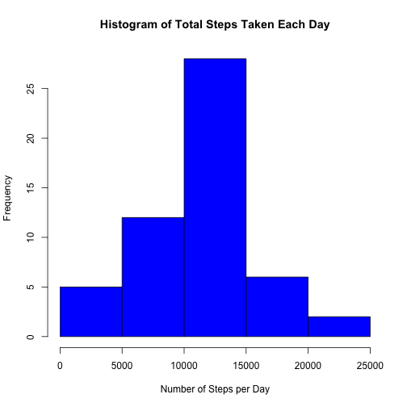
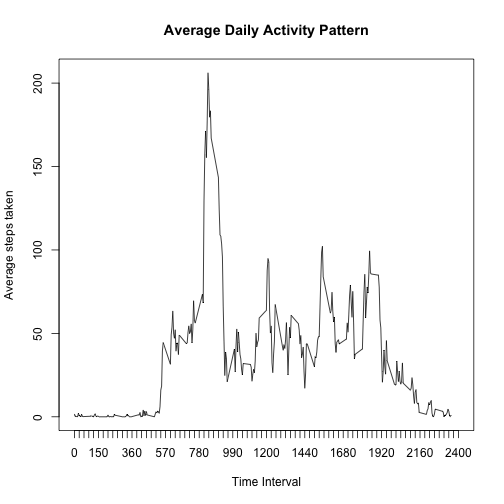
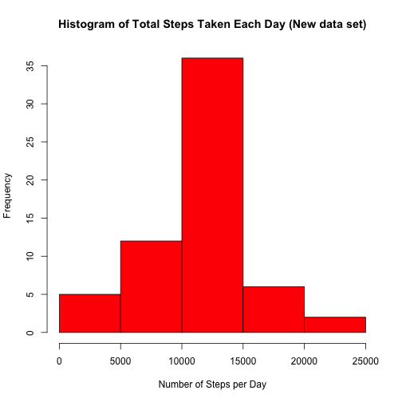
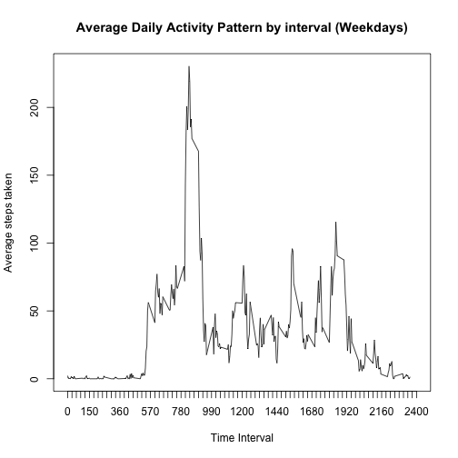
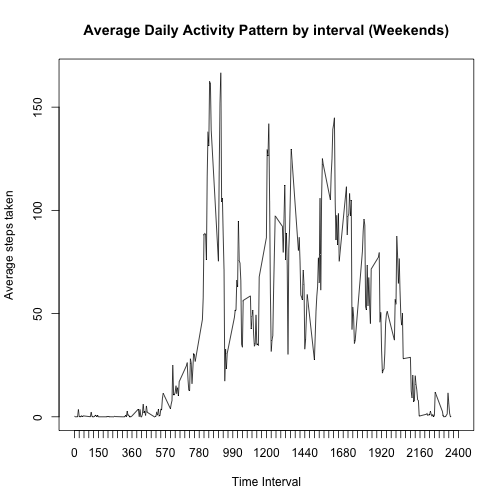

## Loading and preprocessing the data


```r
#setting my working directory
setwd("/Users/user/datasciencecoursera")

#Reading in data 
rawdata <- read.csv("data/activity.csv")
rawdata$date<-as.Date(rawdata$date)
```

## What is mean total number of steps taken per day?

Reporting total steps for each day 

```r
total_steps<-aggregate(list(TotalSteps=rawdata$steps),by=list(Date=rawdata$date),sum,na.omit=TRUE)
print(total_steps)
```

```
##          Date TotalSteps
## 1  2012-10-01         NA
## 2  2012-10-02        127
## 3  2012-10-03      11353
## 4  2012-10-04      12117
## 5  2012-10-05      13295
## 6  2012-10-06      15421
## 7  2012-10-07      11016
## 8  2012-10-08         NA
## 9  2012-10-09      12812
## 10 2012-10-10       9901
## 11 2012-10-11      10305
## 12 2012-10-12      17383
## 13 2012-10-13      12427
## 14 2012-10-14      15099
## 15 2012-10-15      10140
## 16 2012-10-16      15085
## 17 2012-10-17      13453
## 18 2012-10-18      10057
## 19 2012-10-19      11830
## 20 2012-10-20      10396
## 21 2012-10-21       8822
## 22 2012-10-22      13461
## 23 2012-10-23       8919
## 24 2012-10-24       8356
## 25 2012-10-25       2493
## 26 2012-10-26       6779
## 27 2012-10-27      10120
## 28 2012-10-28      11459
## 29 2012-10-29       5019
## 30 2012-10-30       9820
## 31 2012-10-31      15415
## 32 2012-11-01         NA
## 33 2012-11-02      10601
## 34 2012-11-03      10572
## 35 2012-11-04         NA
## 36 2012-11-05      10440
## 37 2012-11-06       8335
## 38 2012-11-07      12884
## 39 2012-11-08       3220
## 40 2012-11-09         NA
## 41 2012-11-10         NA
## 42 2012-11-11      12609
## 43 2012-11-12      10766
## 44 2012-11-13       7337
## 45 2012-11-14         NA
## 46 2012-11-15         42
## 47 2012-11-16       5442
## 48 2012-11-17      14340
## 49 2012-11-18      15111
## 50 2012-11-19       8842
## 51 2012-11-20       4473
## 52 2012-11-21      12788
## 53 2012-11-22      20428
## 54 2012-11-23      21195
## 55 2012-11-24      14479
## 56 2012-11-25      11835
## 57 2012-11-26      11163
## 58 2012-11-27      13647
## 59 2012-11-28      10184
## 60 2012-11-29       7048
## 61 2012-11-30         NA
```

Reporting mean & median of total steps per day ignoring days with no data

```r
total_steps$Mean<-tapply(rawdata$steps,rawdata$date,mean,na.omit=TRUE)
total_steps$Median<-tapply(rawdata$steps,rawdata$date,median,na.omit=TRUE)
total_steps<-na.omit(total_steps)
print(total_steps)
```

```
##          Date TotalSteps       Mean Median
## 2  2012-10-02        127  0.4375000      0
## 3  2012-10-03      11353 39.4166667      0
## 4  2012-10-04      12117 42.0694444      0
## 5  2012-10-05      13295 46.1597222      0
## 6  2012-10-06      15421 53.5416667      0
## 7  2012-10-07      11016 38.2465278      0
## 9  2012-10-09      12812 44.4826389      0
## 10 2012-10-10       9901 34.3750000      0
## 11 2012-10-11      10305 35.7777778      0
## 12 2012-10-12      17383 60.3541667      0
## 13 2012-10-13      12427 43.1458333      0
## 14 2012-10-14      15099 52.4236111      0
## 15 2012-10-15      10140 35.2048611      0
## 16 2012-10-16      15085 52.3750000      0
## 17 2012-10-17      13453 46.7083333      0
## 18 2012-10-18      10057 34.9166667      0
## 19 2012-10-19      11830 41.0729167      0
## 20 2012-10-20      10396 36.0937500      0
## 21 2012-10-21       8822 30.6284722      0
## 22 2012-10-22      13461 46.7361111      0
## 23 2012-10-23       8919 30.9652778      0
## 24 2012-10-24       8356 29.0104167      0
## 25 2012-10-25       2493  8.6527778      0
## 26 2012-10-26       6779 23.5347222      0
## 27 2012-10-27      10120 35.1354167      0
## 28 2012-10-28      11459 39.7847222      0
## 29 2012-10-29       5019 17.4236111      0
## 30 2012-10-30       9820 34.0937500      0
## 31 2012-10-31      15415 53.5208333      0
## 33 2012-11-02      10601 36.8055556      0
## 34 2012-11-03      10572 36.7048611      0
## 36 2012-11-05      10440 36.2465278      0
## 37 2012-11-06       8335 28.9375000      0
## 38 2012-11-07      12884 44.7326389      0
## 39 2012-11-08       3220 11.1770833      0
## 42 2012-11-11      12609 43.7777778      0
## 43 2012-11-12      10766 37.3784722      0
## 44 2012-11-13       7337 25.4722222      0
## 46 2012-11-15         42  0.1423611      0
## 47 2012-11-16       5442 18.8923611      0
## 48 2012-11-17      14340 49.7881944      0
## 49 2012-11-18      15111 52.4652778      0
## 50 2012-11-19       8842 30.6979167      0
## 51 2012-11-20       4473 15.5277778      0
## 52 2012-11-21      12788 44.3993056      0
## 53 2012-11-22      20428 70.9270833      0
## 54 2012-11-23      21195 73.5902778      0
## 55 2012-11-24      14479 50.2708333      0
## 56 2012-11-25      11835 41.0902778      0
## 57 2012-11-26      11163 38.7569444      0
## 58 2012-11-27      13647 47.3819444      0
## 59 2012-11-28      10184 35.3576389      0
## 60 2012-11-29       7048 24.4687500      0
```


Histogram for the total number of steps taken each day

```r
hist(total_steps$TotalSteps,main="Histogram of Total Steps Taken Each Day",
   xlab = "Number of Steps per Day",col="blue")
```




## What is the average daily activity pattern?

Calculating average steps taken for each interval across all days excluding days without data

```r
interval_means<-aggregate(list(Steps=rawdata$steps), list(Interval=rawdata$interval),  mean,na.rm = TRUE)
```


Time series plot of the 5-minute intervals and the average number of steps taken in each, averaged across all days 

```r
plot(interval_means$Interval,interval_means$Steps,main="Average Daily Activity Pattern",xlab ="Time Interval",xaxt="n",xlim = c(0,2400), ylab="Average steps taken",type="l")
axis(side = 1, at=seq(0,2400,30), lwd.ticks=1)
```




Time interval with highest average and it's average

```r
interval_means[interval_means$Steps==max(interval_means$Steps),]
```

```
##     Interval    Steps
## 104      835 206.1698
```

## Imputing missing values

Calculating and reporting the total number of missing values in the dataset

```r
sum(is.na(rawdata))
```

```
## [1] 2304
```

Creating new data set that imputs the respective daily interval average, 
(across all days) into intervals that had missing values 

```r
rawdata2<-rawdata
rawdata2$steps<-ifelse(!is.na(rawdata2$steps), rawdata2$steps, interval_means$Steps)
```


Calculate the total steps taken per day for new data set

```r
total_steps2<-aggregate(list(Steps=rawdata2$steps),by=list(Date=rawdata2$date),sum)
```


Histogram of total steps taken each day for new data set

```r
hist(total_steps2$Steps,main="Histogram of Total Steps Taken Each Day (New data set)",xlab = "Number of Steps per Day",col="red")
```




Reporting mean and median across all days for new data set

```r
#Calculate mean & median of total steps per day for new data set
total_steps2$Mean<-tapply(rawdata2$steps,rawdata2$date,mean)
total_steps2$Median<-tapply(rawdata2$steps,rawdata2$date,median)
print(total_steps2)
```

```
##          Date    Steps       Mean   Median
## 1  2012-10-01 10766.19 37.3825996 34.11321
## 2  2012-10-02   126.00  0.4375000  0.00000
## 3  2012-10-03 11352.00 39.4166667  0.00000
## 4  2012-10-04 12116.00 42.0694444  0.00000
## 5  2012-10-05 13294.00 46.1597222  0.00000
## 6  2012-10-06 15420.00 53.5416667  0.00000
## 7  2012-10-07 11015.00 38.2465278  0.00000
## 8  2012-10-08 10766.19 37.3825996 34.11321
## 9  2012-10-09 12811.00 44.4826389  0.00000
## 10 2012-10-10  9900.00 34.3750000  0.00000
## 11 2012-10-11 10304.00 35.7777778  0.00000
## 12 2012-10-12 17382.00 60.3541667  0.00000
## 13 2012-10-13 12426.00 43.1458333  0.00000
## 14 2012-10-14 15098.00 52.4236111  0.00000
## 15 2012-10-15 10139.00 35.2048611  0.00000
## 16 2012-10-16 15084.00 52.3750000  0.00000
## 17 2012-10-17 13452.00 46.7083333  0.00000
## 18 2012-10-18 10056.00 34.9166667  0.00000
## 19 2012-10-19 11829.00 41.0729167  0.00000
## 20 2012-10-20 10395.00 36.0937500  0.00000
## 21 2012-10-21  8821.00 30.6284722  0.00000
## 22 2012-10-22 13460.00 46.7361111  0.00000
## 23 2012-10-23  8918.00 30.9652778  0.00000
## 24 2012-10-24  8355.00 29.0104167  0.00000
## 25 2012-10-25  2492.00  8.6527778  0.00000
## 26 2012-10-26  6778.00 23.5347222  0.00000
## 27 2012-10-27 10119.00 35.1354167  0.00000
## 28 2012-10-28 11458.00 39.7847222  0.00000
## 29 2012-10-29  5018.00 17.4236111  0.00000
## 30 2012-10-30  9819.00 34.0937500  0.00000
## 31 2012-10-31 15414.00 53.5208333  0.00000
## 32 2012-11-01 10766.19 37.3825996 34.11321
## 33 2012-11-02 10600.00 36.8055556  0.00000
## 34 2012-11-03 10571.00 36.7048611  0.00000
## 35 2012-11-04 10766.19 37.3825996 34.11321
## 36 2012-11-05 10439.00 36.2465278  0.00000
## 37 2012-11-06  8334.00 28.9375000  0.00000
## 38 2012-11-07 12883.00 44.7326389  0.00000
## 39 2012-11-08  3219.00 11.1770833  0.00000
## 40 2012-11-09 10766.19 37.3825996 34.11321
## 41 2012-11-10 10766.19 37.3825996 34.11321
## 42 2012-11-11 12608.00 43.7777778  0.00000
## 43 2012-11-12 10765.00 37.3784722  0.00000
## 44 2012-11-13  7336.00 25.4722222  0.00000
## 45 2012-11-14 10766.19 37.3825996 34.11321
## 46 2012-11-15    41.00  0.1423611  0.00000
## 47 2012-11-16  5441.00 18.8923611  0.00000
## 48 2012-11-17 14339.00 49.7881944  0.00000
## 49 2012-11-18 15110.00 52.4652778  0.00000
## 50 2012-11-19  8841.00 30.6979167  0.00000
## 51 2012-11-20  4472.00 15.5277778  0.00000
## 52 2012-11-21 12787.00 44.3993056  0.00000
## 53 2012-11-22 20427.00 70.9270833  0.00000
## 54 2012-11-23 21194.00 73.5902778  0.00000
## 55 2012-11-24 14478.00 50.2708333  0.00000
## 56 2012-11-25 11834.00 41.0902778  0.00000
## 57 2012-11-26 11162.00 38.7569444  0.00000
## 58 2012-11-27 13646.00 47.3819444  0.00000
## 59 2012-11-28 10183.00 35.3576389  0.00000
## 60 2012-11-29  7047.00 24.4687500  0.00000
## 61 2012-11-30 10766.19 37.3825996 34.11321
```


## Are there differences in activity patterns between weekdays and weekends?

Creating 2 new variables that label the day of the week and day type 

```r
rawdata2$day_of_week<-weekdays(rawdata2$date)
rawdata2$day_type<-ifelse(rawdata2$day_of_week=="Saturday"|rawdata2$day_of_week=="Sunday","Weekend","Weekday")
```


Calculating the average steps taken per interval across weekends and week days

```r
avg_steps_days<-aggregate(steps ~ interval + day_type, data = rawdata2, mean)
```

Plotting average steps per interval for weekdays and weekends 

```r
plot(avg_steps_days[avg_steps_days$day_type=="Weekday",1],
     avg_steps_days[avg_steps_days$day_type=="Weekday",3],
     main="Average Daily Activity Pattern by interval (Weekdays)",
     xlab ="Time Interval",xaxt="n",xlim = c(0,2400), ylab="Average steps taken",type="l")
axis(side = 1, at=seq(0,2400,30), lwd.ticks=1)
```



```r
plot(avg_steps_days[avg_steps_days$day_type=="Weekend",1],
     avg_steps_days[avg_steps_days$day_type=="Weekend",3],
     main="Average Daily Activity Pattern by interval (Weekends)",
     xlab ="Time Interval",xaxt="n",xlim = c(0,2400), ylab="Average steps taken",type="l")
axis(side = 1, at=seq(0,2400,30), lwd.ticks=1)
```




